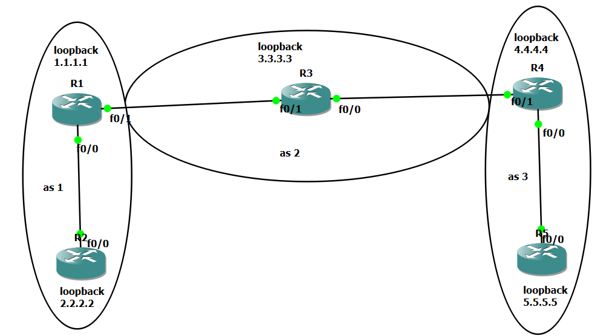

# Multi-AS BGP Network Lab (GNS3 / Cisco)

This repository contains a complete multi-Autonomous System (Multi-AS) BGP network lab topology configured across Cisco IOS routers, integrating both interior and exterior routing protocols[cite: 1, 2, 3, 4, 5, 6].

## Topology Overview
* **AS 1:** Routers R1 & R2 (Using EIGRP internally and BGP externally)[cite: 1, 5, 6]
* **AS 2:** Router R3 (Transit AS)[cite: 1, 4]
* **AS 3:** Routers R4 & R5[cite: 1, 2, 3]

## Key Configurations & Features
* **BGP Configuration:** Multi-AS peering with Loopback interfaces as update-sources[cite: 2, 3, 4, 5, 6].
* **Security:** MD5 Authentication configured for BGP neighbors (`password ahmed`)[cite: 2, 3, 4, 5, 6].
* **IGP Integration:** EIGRP running across internal networks[cite: 2, 3, 4, 5, 6].

## Files Included
* Topology Diagram (`image.png`)[cite: 1]
* Router Configurations (`R1 config.txt` to `R5 config.txt`)[cite: 2, 3, 4, 5, 6]

## Topology Diagram

